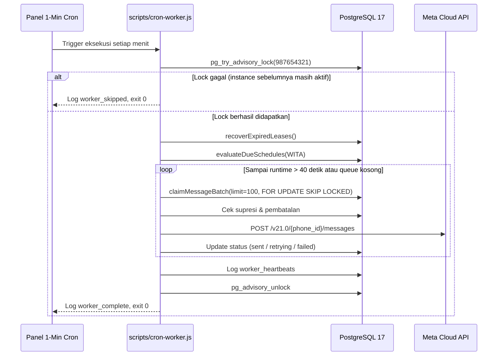

# Runbook: Cron & Background Worker Operations

Panduan operasional dan pemeliharaan untuk time-bounded background cron worker **BPS Provinsi Sulawesi Tengah WhatsApp Broadcast Platform**.

---

## 1. Arsitektur Bounded Worker

Platform sengaja **tidak menggunakan** background daemon jangka panjang (seperti PM2, Docker, Redis, atau systemd service). Sebagai gantinya, platform menggunakan model eksekusi **Time-Bounded 1-Minute Cron**:



### Jaminan Keandalan:
1. **Advisory Lock (`pg_try_advisory_lock`)**: Mencegah tabrakan antar-proses. Jika eksekusi batch sebelumnya membutuhkan waktu 30 detik dan menit berikutnya cron memicu proses baru, proses baru langsung keluar secara aman (`worker_skipped`).
2. **Time Budget Bound (`maxRuntimeMs = 45_000`)**: Setiap proses cron dibatasi maksimal 45 detik. Tersisa jeda 15 detik sebelum jadwal cron menit berikutnya.
3. **Lease Recovery (`recoverExpiredLeases`)**: Jika server atau proses mati mendadak di tengah pengiriman, pesan berstatus `sending` yang `lease_expires_at`-nya telah lewat otomatis dikembalikan ke status `queued`.

---

## 2. Pengaturan Cron di Panel Hosting

Buka menu **Cron Jobs** / **Scheduled Tasks** pada panel hosting Anda.

Tambahkan tugas baru:
- **Interval**: `* * * * *` (Setiap 1 menit)
- **Command**:
```bash
cd /home/bps-sulteng/htdocs/whatsapp.sulteng.bps.go.id && /usr/bin/node scripts/cron-worker.js >> /home/bps-sulteng/htdocs/whatsapp.sulteng.bps.go.id/logs/cron.log 2>&1
```

> [!TIP]
> Pastikan direktori `logs/` telah dibuat: `mkdir -p logs`.

---

## 3. Format Log & Monitoring

Output `scripts/cron-worker.js` berupa satu baris JSON terstruktur per eksekusi:

```json
{
  "event": "worker_complete",
  "timestamp": "2026-09-23T06:16:01.858Z",
  "status": "completed",
  "workerId": "worker-9607a913",
  "durationMs": 175,
  "stats": {
    "recoveredLeases": 0,
    "batchesProcessed": 1,
    "messagesClaimed": 12,
    "sent": 12,
    "retried": 0,
    "failed": 0,
    "suppressed": 0,
    "cancelled": 0
  }
}
```

Jika terdeteksi instance sebelumnya masih berjalan:
```json
{
  "event": "worker_skipped",
  "timestamp": "2026-09-23T06:17:00.120Z",
  "status": "locked_by_other_instance"
}
```

---

## 4. Konfigurasi Log Rotation (`logrotate`)

Untuk mencegah file `logs/cron.log` membengkak, konfigurasikan `logrotate` (jika memiliki akses root VPS) atau atur skrip pembersih berkala:

File `/etc/logrotate.d/bps-whatsapp-cron`:
```text
/home/bps-sulteng/htdocs/whatsapp.sulteng.bps.go.id/logs/*.log {
    daily
    missingok
    rotate 14
    compress
    delaycompress
    notifempty
    copytruncate
}
```

---

## 5. Troubleshooting Worker

### Gejala: Pesan antrean (`queued`) tidak berkurang
1. Jalankan worker secara manual untuk melihat output:
   ```bash
   node scripts/cron-worker.js
   ```
2. Cek apakah ada lock yang menggantung:
   ```sql
   SELECT pid, mode, granted FROM pg_locks WHERE locktype = 'advisory' AND objid = 987654321;
   ```
   *Jika proses pemilik lock sudah mati, hentikan koneksi terkait:*
   ```sql
   SELECT pg_terminate_backend(<pid>);
   ```
3. Cek `system_alerts` untuk melihat apakah Circuit Breaker sedang berada pada status `OPEN`:
   ```sql
   SELECT * FROM system_alerts WHERE code = 'CIRCUIT_BREAKER_OPEN' AND is_resolved = false;
   ```
